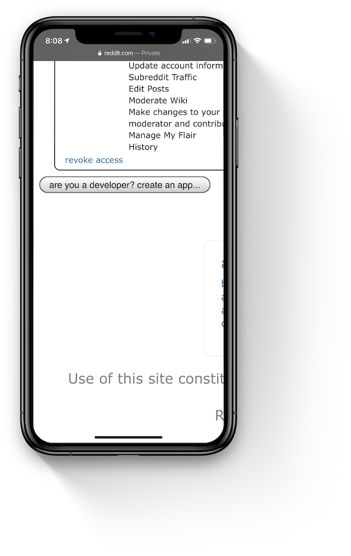
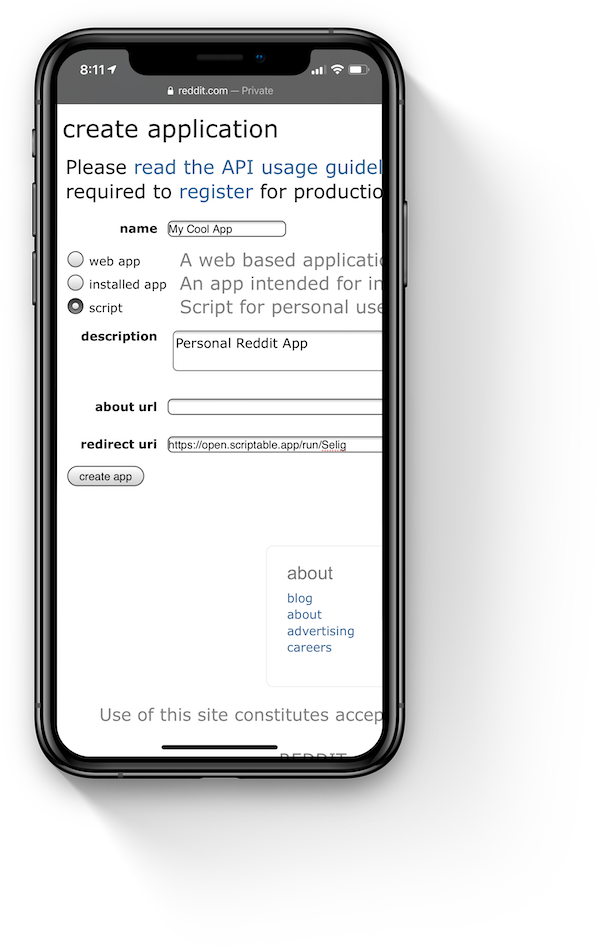
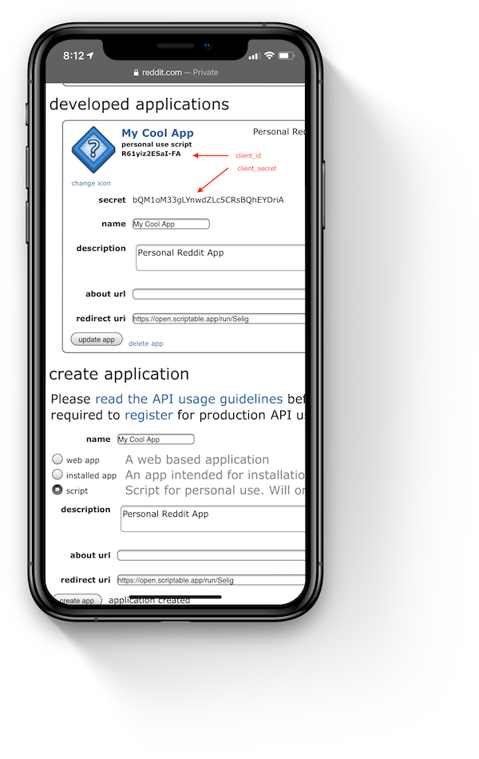
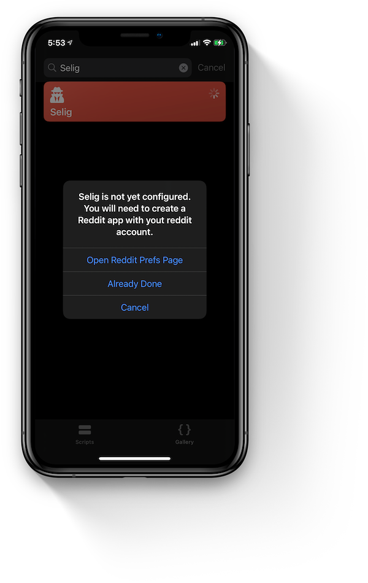
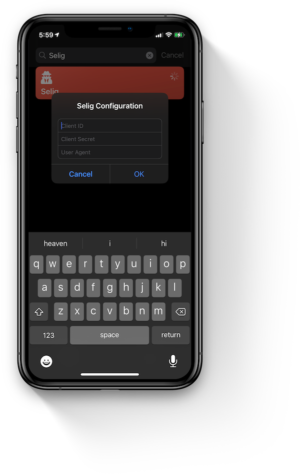
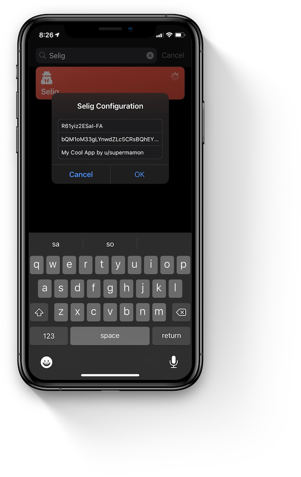
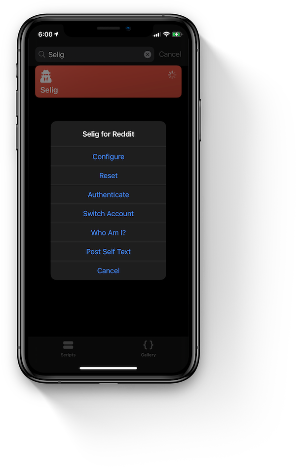
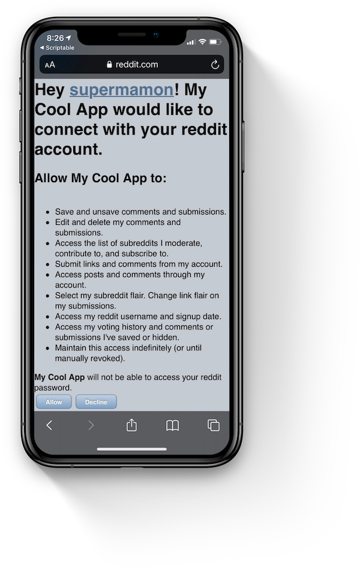
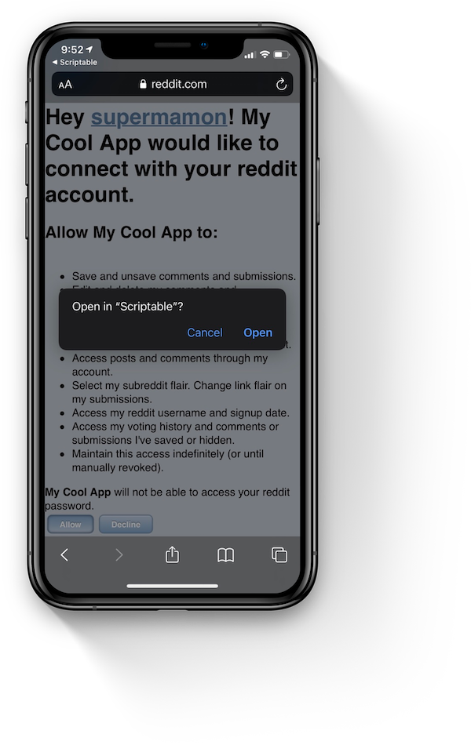
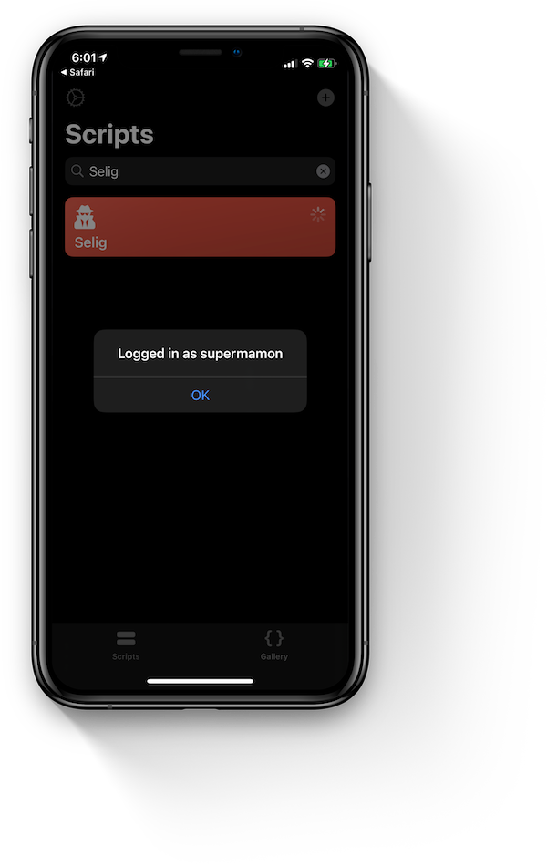

# Selig - Reddit API Wrapper for Scriptable

**Selig** is named after [Christian Selig](https://twitter.com/ChristianSelig), the developer of [Apollo](https://apolloapp.io), my favorite Reddit client.

The objective of this project is to be able (1) pull data from Reddit to be using [Scriptable](https://scriptable.app); and (2) to be able to submit posts. 

## Features
---
The initial release includes the following features.

* Support for multiple accounts
* Submitting text posts, images, videos and image galleries
* Pull profile, karma and trophy data

## Setup Guide
---

### **Create Your Reddit App**

Before running the script, you will need to setup your own Reddit application or client. Don't worry it's not that difficult. 

Login with your reddit account on [https://www.reddit.com/prefs/apps](https://www.reddit.com/prefs/apps). In here you will see a list of applications that you have authorized your account on. You will want to create your own one by clicking the `are you a developer? create an app...` button at the bottom section of the page. If you already done this before, the button will say `create another app`.



Choose `Script` as type and give your app a `name`, and `description`. The `about` box is optional. For the `redirect uri` you will need to input exactly `https://open.scriptable.app/run/Selig`. Click `create app` when done.



Take note of the `client_id` and `client_secret`. You will need these to setup **Selig**.



### **Configuration**

Now that you have your own Reddit app, it's time to use it with Selig. If you haven't done so yet, download the [Selig.js](Selig.js) into Scriptable. If you have [Import-Script](https://github.com/supermamon/scriptable-scripts/tree/master/Import-Script) you can [tap here to import](https://open.scriptable.app/run/Import-Script?url=https://github.com/supermamon/scriptable-selig/Selig.js).


Once imported, go ahead an run **Selig** and you will be prompted with this dialog box.



Since you already have created your Reddit app, go ahead and tap `Already Done`. An entry dialog will be displayed to enter the app details.



Fill in the entry dialog with the corresponding `client_id` and `client_secret`. For the `User-Agent` the usual convention is "*App Name by u/you-reddit-account*". Tap OK when done.



Almost done. You're now in the main menu. Next step is to authenticate your Reddit account. Go ahead and tap `Authenticate`.



Safari will launch and you will be asked to login with your Reddit account. You will be presented with this Reddit permissions page once you have logged-in.



After tapping `Allow` and you will be prompted to `Open in Scriptable`. This will open Scriptable and will save your login session.



Ready for use. You are now logged-in and your Reddit app is ready for use. 

.


## How to Use
---

### **Test**

To test if you have succesfully completed the setup, there are 2 menu items that you can try

1. `Who am I?` shows your username and karma.
2. `Post Self Text` allows you to submit a post to any of your subscribed subreddits.

Go ahead and try them. If you have multiple Reddit accounts, you can tap `Authenticate` again to login with the other account. You can then switch between accounts using `Switch Account`.

If you're having trouble using those, try using `Reset` and start over. You can skip the Reddit app creation part and re-use the same `client_id` and `client_secret`.


### **Usage**

Here'a a very simple example on how to get information from your profile.

```javascript
// initialize
const Selig = importModule('Selig')
const reddit = new Selig()
await reddit.init()

// get the active account's username
var account = await reddit.me()
log(account)
```

This will return a JSON value similar to the one below. I have remove plenty of items here for simplicity but there is plenty more in there.
```json
{
    "is_employee": false,
    "subreddit": {
        "display_name": "u_supermamon",
        "subscribers": 50,
        "display_name_prefixed": "u/supermamon",
        "url": "/user/supermamon/",
        "subreddit_type": "user"
    },
    "snoovatar_img": "https://i.redd.it/snoovatar/snoovatars/d0fda6dd-0995-4f71-a688-199300e36a7b.png",
    "verified": true,
    "over_18": true,
    "has_verified_email": true,
    "total_karma": 10000,
    "inbox_count": 0,
    "name": "supermamon",
    ...
}
```

## API
---

### Properties
* `.currentUser` - currently logged in username
* `.cache` - path to primary storage location
* `.currentUserFile` - path to current user's session file
* `.home` - path to store all user session files

### Methods
* `async .me()` - returns the active account's profile data
* `async .karma()` - returns the active account's karma breakdown
* `async .trophies()` - returns the active account's trophy list
* `.listAccounts()` - returns the list of authenticated accounts
* `async .switchAccount(username)` - changes the active account to another
* `async .postSelfText({sr, title, text, nsfw=false, sendreplies=true, resubmit=false, spoiler=false})` - submit a self text
* `async .postImage({sr, title, imagePath, nsfw=false, sendreplies=true, resubmit=false, spoiler=false})` - submit an image.
* `async .postVideo({sr, title, videoPath, thumbnailPath, nsfw=false, sendreplies=true, resubmit=false, spoiler=false})` - submit a video
* `async postGallery({sr, title, imagePaths, nsfw=false, sendreplies=true, resubmit=false, spoiler=false})` - sumit multiple images
* `.stashImage(imageObject, type)` - saves a image into temporary storage and returns path full path. `imageObject` must be an `Image` data type. `type` is either `jpeg` or `png`, `jpeg` is default if not provided.
* `.unstashImages(imagePaths)` - accepts an array of filePaths that will be deleted.
* `async inbox(after, limit)` - returns the active account's inbox messages
* `async deleteMessage(id)` - deletes the message indicated by `id` from the account's inbox
* `async makeFavorite(sr_name)` - mark a subreddit as a favorite
* `async getMyOverview({username, after, before, sort, limit })` - get the user's post/comment history. paramters are optional. if `username` is not provided, it will use the current logged-in user's username.
* `async updatePost(thing_id, text)` - update the contents of a post/comment 


## Examples
---

* [selig-widget-sample](examples/selig-widget-sample.js) - widget that displays the current account's karma.
* [selig-submit-image-example](examples/selig-submit-image-example.js) - script to submit an image


## Roadmap
---

The plan is to add as mant API endpoints as possible but the following are the current items in priority but not in order.

- [ ] Logout
- [x] Subreddit's list
- [ ] Commenting
- [x] Deleting Posts/Comments
- [ ] Mark/Unmark NSFW
- [x] Inbox Messages, read/delete
- [x] Mark subreddit as favorite
- [x] Update Posts/Comments


